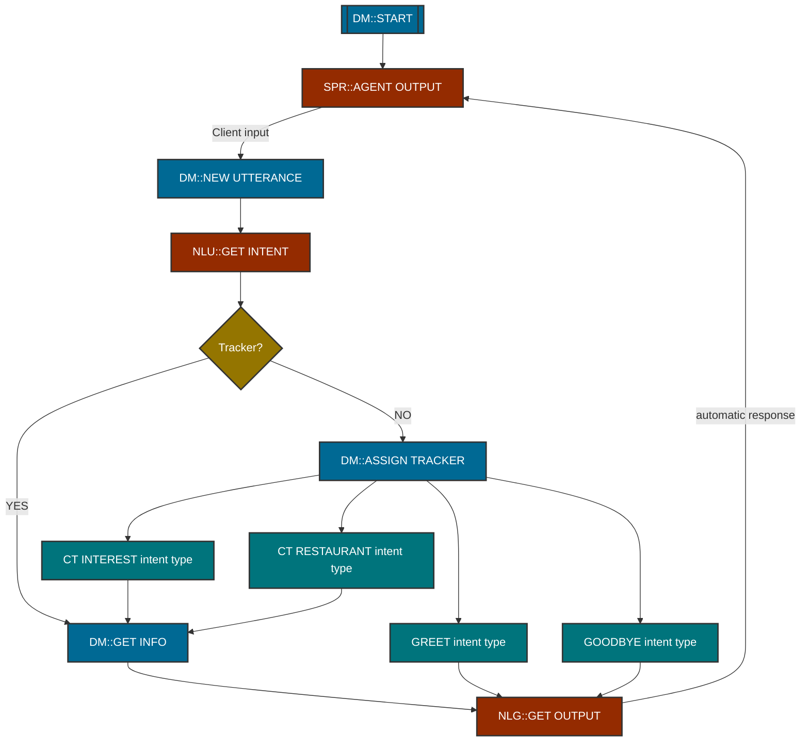

# WHY THIS?

Github doesn't support mermaid markdown diagrams, which are really cool and easy to do using any markdown editor such as `typora`. I found a solution, you can do your markdown job locally and copy the `mermaid code` in this page:
https://mermaid-js.github.io/mermaid-live-editor
This will generate a link, that github will transform to an image.

## Architecture

Architecture image generated:
https://mermaid-js.github.io/mermaid-live-editor/#/edit/eyJjb2RlIjoiZ3JhcGggVEJcbiAgICBpZDFbW0RNOjpTVEFSVF1dOjo6ZG1fZnVuY3Rpb24gLS0-IGlkMltTUFI6OkFHRU5UIE9VVFBVVF06Ojpjb3JlX25vZGVcbiAgICBpZDIgLS0-IHxDbGllbnQgaW5wdXR8aWQzW0RNOjpORVcgVVRURVJBTkNFXTo6OmRtX2Z1bmN0aW9uXG4gICAgaWQzIC0tPiBpZDRbTkxVOjpHRVQgSU5URU5UXTo6OmNvcmVfbm9kZSAtLT4gaWQ1e1RyYWNrZXI_fTo6OnF1ZXN0aW9uXG4gICAgaWQ1IC0tPnxOT3wgaWQ2W0RNOjpBU1NJR04gVFJBQ0tFUl06OjpkbV9mdW5jdGlvblxuICAgIGlkNSAtLT58WUVTfCBpZDdbRE06OkdFVCBJTkZPXTo6OmRtX2Z1bmN0aW9uXG4gICAgaWQ3IC0tPmlkOFtOTEc6OkdFVCBPVVRQVVRdOjo6Y29yZV9ub2RlIC0tPnxhdXRvbWF0aWMgcmVzcG9uc2V8IGlkMlxuICAgIGlkNiAtLT5pZDlbR1JFRVQgaW50ZW50IHR5cGVdOjo6ZGVzY2VuZGFudHNcbiAgICBpZDYgLS0-aWQxMFtDVCBJTlRFUkVTVCBpbnRlbnQgdHlwZV06OjpkZXNjZW5kYW50c1xuICAgIGlkNiAtLT5pZDExW0NUIFJFU1RBVVJBTlQgaW50ZW50IHR5cGVdOjo6ZGVzY2VuZGFudHNcbiAgICBpZDYgLS0-aWQxMltHT09EQllFIGludGVudCB0eXBlXTo6OmRlc2NlbmRhbnRzXG4gICAgaWQ5IC0tPmlkOFxuICAgIGlkMTIgLS0-aWQ4XG4gICAgaWQxMCAtLT5pZDdcbiAgICBpZDExIC0tPmlkN1xuXG5cbiAgICBjbGFzc0RlZiBkbV9mdW5jdGlvbiBmaWxsOiMwMDY5OTQsc3Ryb2tlOiMzMzMsc3Ryb2tlLXdpZHRoOjJweCxjb2xvcjojZmZmXG4gICAgY2xhc3NEZWYgZGVzY2VuZGFudHMgZmlsbDojMDA3NDdjLHN0cm9rZTojMzMzLHN0cm9rZS13aWR0aDoycHgsY29sb3I6I2ZmZlxuICAgIGNsYXNzRGVmIGNvcmVfbm9kZSBmaWxsOiM5NDJiMDAsc3Ryb2tlOiMzMzMsc3Ryb2tlLXdpZHRoOjJweCxjb2xvcjojZmZmXG4gICAgY2xhc3NEZWYgcXVlc3Rpb24gZmlsbDojOTQ3NTAwLHN0cm9rZTojMzMzLHN0cm9rZS13aWR0aDoycHgsY29sb3I6I2ZmZiIsIm1lcm1haWQiOnsidGhlbWUiOiJkZWZhdWx0In0sInVwZGF0ZUVkaXRvciI6ZmFsc2V9

